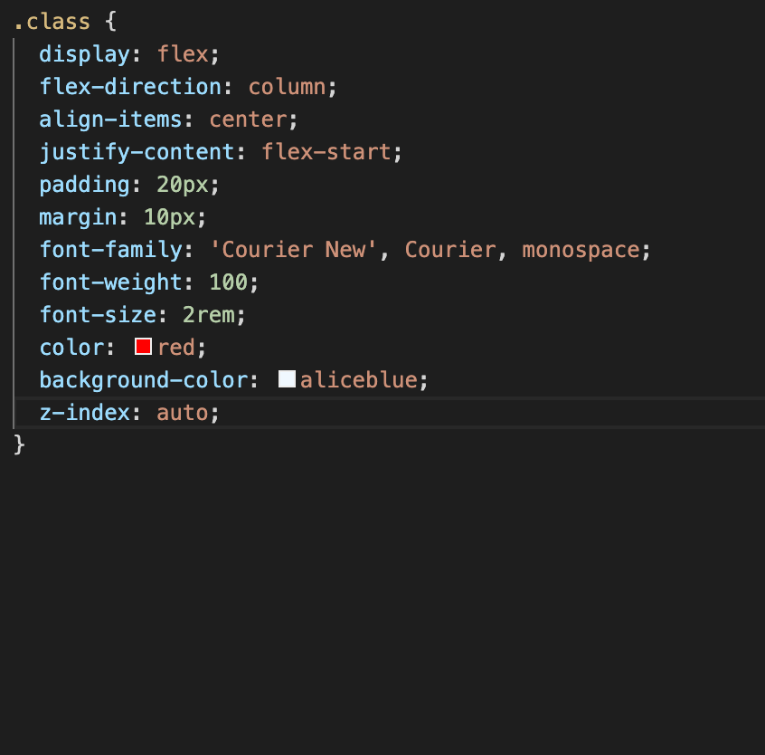
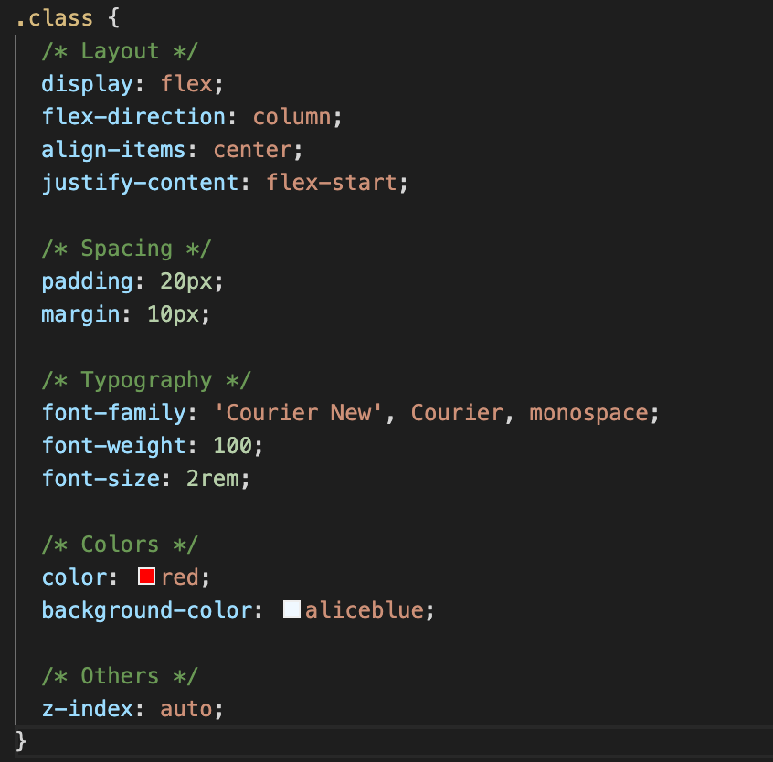
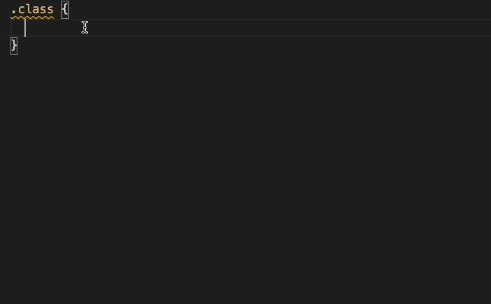

# css-structure-comment

A VS Code extension which helps you add better comments to your CSS.

## Motivation
This extension is aimed for people writing a lot of CSS because when a CSS class has a lot of CSS properties, it starts to get overwhelming to read it. This extension aims to organise your CSS inside the block into five different parts as given in gif below.

## How it looks

| Before      | After |
| ----------- | ----------- |
|  |  |

## Usage

Just type `csc` in your CSS file and press `Enter`. 

## Development

Just open this repo in VSCode and press `F5` to fire the extension in new window.
